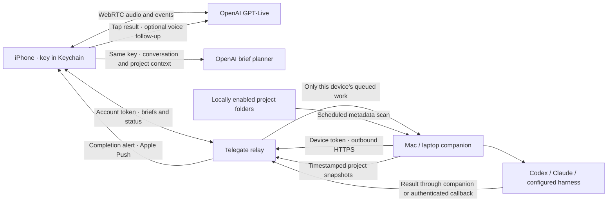

# Telegate

**More life. Less screen.**

Talk it through. Send it off. Get back to your day.

**Telegate Community — free to self-host. A simpler App Store experience is planned for later.**

Clone the repo, host your relay, bring your OpenAI key, and build onto your iPhone with Xcode. No Telegate subscription is required. Infrastructure and API usage are yours to operate and pay for.

**Developer preview:** the development build is installed on the test iPhone; live voice and physical-device acceptance are still pending. See [tomorrow’s test checklist](docs/TOMORROW-READINESS.md) and [verification](docs/VERIFICATION.md).

**[Visit the Telegate landing page →](https://telegate.danielfoch.chatgpt.site)**

## Install with your coding agent

**[Copy the one-shot install prompt →](docs/INSTALL-WITH-AN-AGENT.md)**

Paste it into Codex or Claude Code on your Mac. Your agent clones the repo, prepares the relay and native apps, installs to your iPhone when signing is ready, and guides pairing. Apple sign-in, device trust and signing approvals still require you. No invitation code is required.

## Start here

1. [Host your relay](docs/SELF-HOST.md) on your own HTTPS infrastructure.
2. [Put Telegate on your iPhone](docs/DIY-IPHONE.md) with the **TelegateDIY** scheme.
3. Pair a computer, talk through a request, send it to your harness, and get back to your day.

```sh
git clone https://github.com/danielfoch/telegate.git
cd telegate
npm run doctor -- --phone
npm run setup
open Telegate.xcodeproj
```

The setup asks for your deployed relay address. The committed Xcode project does not require regeneration for a normal clone. Choose **TelegateDIY** for a free Personal Team installation, or **Telegate** for the full push-enabled build. DIY has in-app results without background push alerts; Apple's free provisioning requires rebuilding after seven days.

[DIY installation guide](docs/DIY-IPHONE.md) · [Community and commercial roadmap](docs/ROADMAP.md) · [Developer handoff](docs/BUILD-HANDOFF.md)

Native iPhone voice delegation, a Mac companion, and a per-account task relay. A user talks through a request, chooses a computer and harness, and sends a real task brief to that computer. Each user brings their own OpenAI project API key.

This is a separate product from Homies Voice. It does not change the existing Homies Voice deployment, its connector credentials, or its sharing settings.

## What is implemented

- SwiftUI iPhone/iPad app with account creation, login, recovery, deletion, and OpenAI key verification. The key is saved in the device’s Keychain and sent only to OpenAI.
- Native WebRTC microphone and speaker connection to GPT-Live, transcript events, client delegation, and GPT-5.6 Terra task brief preparation.
- A large Start/End call control, microphone-permission recovery, interruption handling, and graceful session close.
- A `Start voice chat` App Shortcut for Siri, Shortcuts, and an iPhone Action Button. The user assigns it in Settings; the app cannot change the hardware-button setting itself.
- Native **Telegate Connect** for Mac: a visual agent picker with recognizable icons, a simple phone-pairing card, and optional advanced settings. [Mac setup guide](docs/CONNECT.md).
- Portable Node companion for macOS, Linux, and Windows-compatible command harnesses. It requires Node 24+ and installed, authenticated harness executables.
- Multiple users and computers; a one-time pairing code; independent, revocable device tokens; exact-device task routing; local execution without shell interpolation.
- Codex, Claude Code, [OpenClaw and Hermes Agent](docs/integrations/OPENCLAW-HERMES.md), locally configured command adapters, and HTTPS task-submission adapters. An optional [Grok Bot / Clydesdale adapter](docs/integrations/GROKBOT.md) submits saved tasks to a dedicated Grok webhook routine and accepts completion callbacks. Configure the routine and relay before using it; other cloud adapters still require a compatible provider endpoint.
- Durable task IDs and outboxes, atomic claiming, heartbeat leases, explicit uncertain outcomes, and no automatic re-execution after a crash.
- Completion reporting from local harnesses and task-scoped callbacks from cloud harnesses. An encrypted APNs registration and durable push outbox notify the task owner without speaking or including work details on the lock screen.
- Tap a notification to review the result, choose **Read it to me**, or **Continue by voice**. Explicit follow-up work can resume the exact saved Codex, Claude, OpenClaw or Hermes session. Opening a result never submits a job by itself.
- Per-computer project scans: manual, every 5/15/30 minutes, every 1/3/6/12 hours, or daily. Folder sharing is enabled locally, per harness. A phone can change the interval but cannot add scan roots.
- Project snapshots fed into voice and brief preparation with timestamps. Scans collect folder name, Git branch, change count, latest commit subject and time. No file contents, diffs, filenames, repository remotes, or credentials are uploaded by the scanner.

## Your account dashboard

The dashboard opens with **Get work done. Get your day back.**, a large voice-chat button, all-time/last-7-days counters for prompts shipped and work completed, an estimated screen-time-saved card, and personal completion milestones.

Shipped means the relay accepted a prompt for delivery; drafts do not count and retries count once. Hours are explicitly **estimated**, using completed tasks × an adjustable personal minutes-per-task baseline (initially 30, configurable from 0 to 480). No screen or location surveillance is used. Agent runtime is not treated as time saved. Preferences sync to the user’s account across phones.

A community leaderboard is optional and off by default. Each self-hosted relay has its own board; there is no global data-sharing service. Users choose a separate display name before joining. It ranks last-7-days prompts shipped and displays completion counts; estimated hours, account names, task contents, computers, and projects stay private. There are no fabricated competitors or automatic enrollment. See [brand and metric definitions](docs/BRAND-AND-METRICS.md).

## Develop the apps

Requirements: Xcode with iOS 17+ SDK and a working simulator runtime, Node 24+. XcodeGen is only needed after changing `project.yml`. Git is needed on companion computers for Git project metadata. Resolve the pinned WebRTC Swift package during the first build.

```sh
npm test
open Telegate.xcodeproj
```

Choose **Telegate** for iPhone/iPad or **TelegateConnect** for Mac. Debug builds default to `http://127.0.0.1:8790` for same-Mac development. On a real phone, use the HTTPS address of the deployed relay. Both apps expose a pilot service-address setting during setup. Use `npm run setup` to write the service address, unique app ID and optional team ID into ignored `Config.local.xcconfig`. This file survives project regeneration.

Start the local service in a separate terminal:

```sh
npm start
```

It binds to loopback by default and stores data under `data/telegate.sqlite`. No OpenAI key belongs in the relay’s environment.

### Test from your phone without hosting yet

`scripts/local-relay.sh install` runs the relay on this Mac behind a temporary Cloudflare quick tunnel and keeps both alive with launchd, so a phone on any network can reach it over HTTPS. `status` prints the current address and health; `url` prints only the address; `restart` gets a fresh one. Quick tunnels change hostname whenever they restart, so use the address it prints on both devices and update it in the phone’s **Settings → Change service address…** and in Connect’s Settings if it changes. Requires `cloudflared` (`brew install cloudflared`) and `secrets/relay-preview.env`. For everyday use, host the relay permanently ([SELF-HOST.md](docs/SELF-HOST.md)).

### First real-device trial

1. Deploy the relay over HTTPS (see [Release guide](docs/RELEASE.md)). Install a signed iPhone build and Telegate Connect on the computer.
2. On the phone, create an account and save its recovery key. Enter your own OpenAI key. Your OpenAI project must support `gpt-live-1` and `gpt-5.6-terra`.
3. On the computer, use the same relay address. Add Codex/Claude/custom harnesses; choose their existing executables and working folders. Authenticate each harness in its normal app/CLI first.
4. Enable **Let voice know what I’m working on** only for the folders you want shared. Click **Pair my phone**.
5. On the phone: **Computers → +**, enter the code, verify the computer’s name and harnesses, and connect it. Leave Telegate Connect running and the computer awake.
6. Choose the destination on the Call tab. Tap **Start talking** and grant microphone access. Ask for a small, observable task in a test project. Check the task in both Telegate and the actual harness.
7. In **Computers → Project awareness**, choose the scan frequency or request a scan. Confirm its timestamp, then ask about that project during a call.
8. For DIY, reopen **Tasks** to check completion. For the full build, enable **Settings → Completion notifications** after the operator configures APNs. Finish a test task with the app backgrounded, tap the notification, and verify the result. Ask for a small follow-up and verify the original harness session resumes.
9. Configure **iPhone Settings → Action Button → Shortcut → Telegate → Start voice chat**. The shortcut foregrounds the app, checks setup, and starts voice. iPhone may require unlocking.

`Send when I ask` is enabled by default. Disable it in Settings to prepare drafts for review instead. Ending a call does not cancel tasks already submitted. Queued/draft tasks can be cancelled from Tasks; active work must be inspected in its harness.

### Terminal companion

```sh
npm run connect
npm run connect -- check
npm run connect -- run
```

The setup wizard asks for the relay, computer name, harnesses, folders, and sharing preferences, then displays a phone pairing code. Its config and durable state live in `~/.config/telegate/` with restrictive file permissions. Both companions keep their device token in that private config file (the Mac app uses `~/Library/Application Support/Telegate/computer.json`, mode 0600); revoke the computer from the phone to invalidate a token. Do not copy one computer’s token to another: pair each separately.

For a Windows command provided as a `.cmd` wrapper, configure its underlying executable (for example `node.exe` with the CLI script argument) rather than enabling a shell. The Windows companion is source-compatible but still needs Windows platform verification.

## How it works



A task-submission endpoint starts work; the completion webhook reports its outcome later. The voice call can end while the harness continues. No voice session needs to stay open for completion: the relay stores the result and, in a configured push-enabled build, sends a normal push alert. The user chooses whether to read it, hear it, or discuss the next step. Local harness runs default to a four-hour limit, configurable up to 24 hours; cloud execution limits belong to the provider.

The timer runs in Telegate Connect, not in an OpenAI API key and not in iOS background scheduling. Local metadata scans make no OpenAI calls. The same user key powers voice and the planner’s interpretation of project context. A sleeping/offline computer cannot scan or execute tasks; its last-known snapshot remains marked with its scan time.

See [API contract](docs/API.md), [release and deployment](docs/RELEASE.md), and [verification record](docs/VERIFICATION.md).

## License

Telegate source is available under the [MIT License](LICENSE). Third-party dependencies retain their own licenses; see [third-party notices](THIRD_PARTY_NOTICES.md).

## Landing page

The marketing site lives in [`website/`](website/README.md), with a static export and Vercel configuration. Hosting the landing page is separate from hosting the relay.
